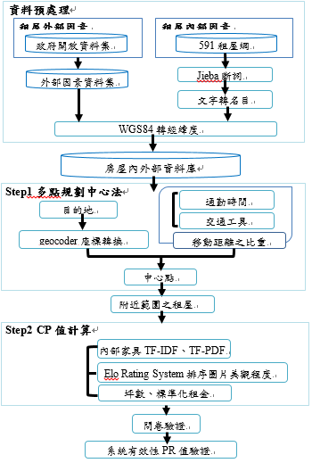

# House for you - Apartment Recommended System

We combine multiple <b>machine learning algorithms</b>, <b>python crawling</b> skills, Taiwan <b>Open Datasets</b>, <b>Jeiba preprocessing</b>, 
and 591 rent website to develop an Apartment Recommended System, which is called <b>house for you</b>. For the frontend visualization, we
use <b>HTML</b>, <b>JavaScript</b>, <b>CSS</b>, and also provide statistical chart for data analysis. Through the web design and algorithm implement, 
the recommended system owns a high accuracy, which is evidenced by statistics called <b>spearman correlation</b>.

<b>House for you provides the most suitable rented apartments according to the users' favor. 
Whenever you come to an alien environment, using "house for you" can solve what you are annoyed about living.</b>

## Datasets

  
      

  We take advantage of multiple datasets in the Taiwan open datasets at https://data.gov.tw/dataset/6564, 
  and combine with the same address, which will lead into a complete data table and benefit of analysis. 
  In this way, we can facilitate the analysis of the <b>environment effective factor of the apartment</b>, 
  where the user is favor of but has no understanding yet. Quantify the factor and include into the 
  cost–performance ratio we design for the prediction.

  
  On the other hand, crawled the 591 (https://www.591.com.tw/) apartment-rented system using python until
  3 May 2019, and 5362 records have been collected. For the preprocessing, the <b>Jeiba</b> to segment Chinese words
  and <b>regular expression</b> was implemented. After the work, we will get the <b>internal effective factor of the 
  apartment</b> that renter providing, like the image in website, furnitures, and discount, etc. Likewise, Quantify the factor 
  and include into the cost–performance ratio we design for the prediction.

## Workflow

    
             
  

## Algorithms

## Usage

