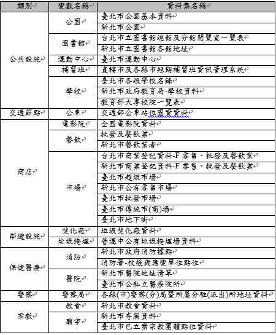
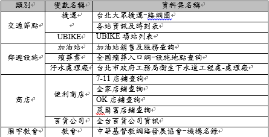

# House for you - Apartment Recommended System

We combine multiple <b>machine learning algorithms</b>, <b>python crawling</b> skills, Taiwan <b>Open Datasets</b>, <b>Jeiba preprocessing</b>, 
and 591 rent website to develop an Apartment Recommended System, which is called <b>house for you</b>. For the frontend visualization, we
use <b>HTML</b>, <b>JavaScript</b>, <b>CSS</b>, and also provide statistical chart for data analysis. Through the web design and algorithm implement, 
the recommended system owns a high accuracy, which is evidenced by statistics called <b>spearman correlation</b>.

<b>House for you provides the most suitable rented apartments according to the users' favor. 
Whenever you come to an alien environment, using "house for you" can solve what you are annoyed about living.</b>

## Datasets

  

    
  

  

    
  

## Workflow

## Algorithms

## Functionality
